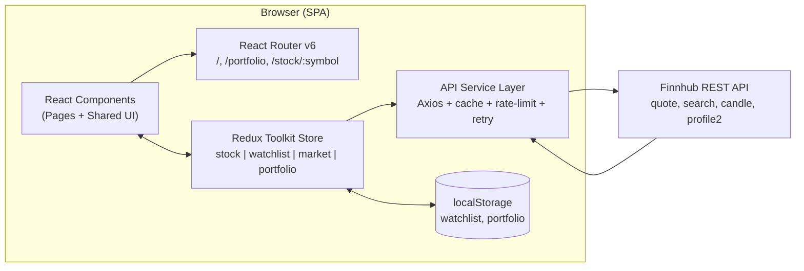

# Stock Market Dashboard — Step-by-Step Build Guide

> **Archived: original build playbook.** This document is the original roadmap used to build the Stock Market Dashboard project from scratch. The codebase may have evolved since this guide was written (for example, the addition of the virtual portfolio feature and route-based code-splitting). For current setup, architecture, and deployment notes, see [../README.md](../README.md).

---

> **Project Summary:** Stock Market Dashboard is a backend-less (client-only) single-page application (SPA) that fetches real-time market data from the Finnhub API. Users can view market indices and the day's top gainers and losers, search for symbols, inspect interactive price charts, maintain a watchlist, and trade with $100,000 of virtual cash at live prices while tracking profit and loss (paper trading). All user data (watchlist, portfolio) is stored in the browser's `localStorage`; there is no server, authentication, or database. The application uses Redux Toolkit for centralized state management, React Router for page routing, React Hook Form + Zod for form validation, an Axios-based API service layer (in-memory cache + rate limiting + retry/backoff), Recharts for data visualization, and Tailwind CSS for a dark-themed, accessible, and responsive UI.

Each step below is a self-contained prompt. Execute them in order.

Stack: React 18, TypeScript, Vite, Redux Toolkit, React Router v6, React Hook Form, Zod, Axios, Recharts, Tailwind CSS, Finnhub API, localStorage.

---

## Table of Contents

**PHASE 1 — Project Foundation**

- STEP 1 — Project Scaffolding & Dependency Setup
- STEP 2 — Tooling: TypeScript, Tailwind, ESLint & Environment

**PHASE 2 — Core Infrastructure**

- STEP 3 — Domain Types & Zod Validation Schemas
- STEP 4 — API Service Layer (Finnhub + cache/rate-limit/retry)
- STEP 5 — Redux Store & Typed Hooks
- STEP 6 — Reusable Hooks & Utilities

**PHASE 3 — Shared UI & Layout**

- STEP 7 — Layout, Navigation & SearchForm
- STEP 8 — Shared Presentational Components

**PHASE 4 — Feature Pages**

- STEP 9 — Dashboard Page (market overview & top movers)
- STEP 10 — Stock Detail Page (charts & statistics)
- STEP 11 — Virtual Portfolio (slice, page & components)

**PHASE 5 — Polish & Deploy**

- STEP 12 — Performance: Code-Splitting & Memoization
- STEP 13 — Build, Lint & Netlify Deployment

**Appendices**

- Appendix A — Shared Constants & Environment Variables
- Appendix B — Recurring Patterns (slices, thunks, forms)
- Appendix C — Pre-flight Checklist
- Appendix D — Common Pitfalls

---

## Global Build Rules (apply to EVERY step)

- **No git operations.** Do not run any `git` commands in any step of this guide (`init`, `add`, `commit`, `push`, `branch`, etc.). Version control is handled manually by the user.
- Do not install unapproved packages. Install only the dependencies explicitly listed in the relevant step.
- Do not start long-running processes unless requested (for example, leaving the `npm run dev` watcher running). One-shot commands such as build/lint are fine.
- Treat every step as a self-contained task; a step must not assume implicit dependencies on another and should state the context it needs.
- Preserve existing local patterns: ES6+, React Hooks, `async/await`, functional components, `camelCase` naming, English identifiers.
- Prioritize security, accessibility (a11y), performance, and the DRY principle in every step.
- Do not add unnecessary dependencies; prefer native methods where possible.

---

## Architecture at a Glance

The application runs entirely on the client. Its only external dependency is the Finnhub REST API; persistence is provided by the browser's `localStorage`.



Data flow: Components connect to the store via `useAppSelector`/`useAppDispatch`. Async thunks call the API service layer; the service layer queues requests (rate limiting), caches them, and retries on failure. The `watchlist` and `portfolio` slices write their state to `localStorage` on every mutation and read from it on startup.

---

# PHASE 1 — PROJECT FOUNDATION

---

## STEP 1 — Project Scaffolding & Dependency Setup

**Goal:** Set up the Vite + React + TypeScript skeleton and install the runtime dependencies.

**Files/folders:** `package.json`, `vite.config.ts`, `index.html`, `src/main.tsx`, `public/`.

**Dependencies (runtime):**

```bash
npm create vite@latest stock-market-dashboard -- --template react-ts
cd stock-market-dashboard
npm install @reduxjs/toolkit react-redux react-router-dom react-hook-form @hookform/resolvers zod axios recharts
```

**Implementation notes:**

- `package.json` scripts: `dev` (`vite`), `build` (`tsc -b && vite build`), `lint` (`eslint .`), `preview` (`vite preview`).
- `src/main.tsx` wraps the app in `StrictMode` > `Provider` (Redux) > `BrowserRouter`, in that order:

```tsx
createRoot(document.getElementById('root')!).render(
  <StrictMode>
    <Provider store={store}>
      <BrowserRouter>
        <App />
      </BrowserRouter>
    </Provider>
  </StrictMode>
);
```

**Acceptance:** `npm run dev` opens a blank React page with no console errors.

---

## STEP 2 — Tooling: TypeScript, Tailwind, ESLint & Environment

**Goal:** Configure type checking, styling, and linting infrastructure.

**Files/folders:** `tsconfig.json`, `tsconfig.node.json`, `tailwind.config.js`, `postcss.config.js`, `eslint.config.js`, `src/index.css`, `.env.example`, `.gitignore`.

**Dependencies (dev):**

```bash
npm install -D tailwindcss postcss autoprefixer eslint typescript-eslint eslint-plugin-react-hooks eslint-plugin-react-refresh globals @eslint/js
npx tailwindcss init -p
```

**Implementation notes:**

- `tsconfig.json`: `strict: true`, `noUnusedLocals`, `noUnusedParameters`, `jsx: react-jsx`, path alias `@/* -> src/*`, and `references: [{ "path": "./tsconfig.node.json" }]`.
- `tsconfig.node.json` **must include `composite: true`**; otherwise `tsc -b` (build mode) fails. To keep the project root clean, redirect emitted output with `outDir` and `tsBuildInfoFile` to `./node_modules/.tmp/...` (a composite project cannot use `noEmit`, so move the output instead of disabling it).
- In `tailwind.config.js`, set `content: ['./index.html', './src/**/*.{ts,tsx}']` and define the dark theme color palette (slate/blue/emerald/red). `src/index.css` includes the Tailwind directives (`@tailwind base/components/utilities`) and helper classes such as `.bg-card` and `.btn-primary`.
- `.gitignore` must exclude `node_modules`, `dist`, and **`.env`** (critical so the API key is never committed).

**Acceptance:** `npm run lint` runs clean; Tailwind classes compile.

---

# PHASE 2 — CORE INFRASTRUCTURE

---

## STEP 3 — Domain Types & Zod Validation Schemas

**Goal:** Centralize the type contracts shared across the app and the form validation schemas.

**Files/folders:** `src/types/index.ts`, `src/validation/schemas.ts`.

**Implementation notes:**

- `src/types/index.ts` interfaces: `StockQuote`, `HistoricalDataPoint`, `WatchlistItem`, `SearchResult`, `MarketIndex`, `ChartDataPoint`, `TimeRange` (union: `'1D' | '1W' | '1M' | '3M' | '6M' | '1Y' | '5Y'`), `ApiStatus` (`'idle' | 'loading' | 'succeeded' | 'failed'`), and the state types for each slice (`StockState`, `WatchlistState`, `MarketState`, `PortfolioState`). Portfolio types: `PortfolioHolding`, `Transaction`, `TransactionFormData`.
- `src/validation/schemas.ts` Zod schemas: `symbolSchema` (1-5 uppercase letters, `.transform(toUpperCase)`), `searchFormSchema`, `watchlistItemSchema`, `timeRangeSchema`. Export types via `z.infer` (DRY).

**Acceptance:** Types and schemas can be imported from other modules; there is no duplicated source of truth.

---

## STEP 4 — API Service Layer (Finnhub + cache/rate-limit/retry)

**Goal:** Concentrate all Finnhub calls in a single resilient service module.

**Files/folders:** `src/services/api.ts`.

**Implementation notes:**

- Read the key via `import.meta.env.VITE_FINNHUB_API_KEY`; base URL is `https://finnhub.io/api/v1`. Add the token globally to the Axios instance `params`.
- Build three helper layers:
  - `ApiCache` class: a TTL-based (e.g. 60 s) in-memory `Map` cache.
  - `RequestQueue` class: serializes requests with a `RATE_LIMIT_DELAY` (e.g. 300 ms) to respect the Finnhub free tier.
  - `retryWithBackoff`: retries on 429/5xx errors with exponential backoff.
- `cachedRequest(cacheKey, request, skipCache?)` combines the three.
- `stockApi` methods: `getQuote`, `searchSymbols`, `getHistoricalData` (candle), `getMarketIndices` (SPY/QQQ/DIA proxy), `getTopGainers`/`getTopLosers`, `getPrice`, `getMultiplePrices` (for the portfolio), `clearCache`, `invalidateSymbol`.
- If the Finnhub free-tier `candle` endpoint returns no data, gracefully fall back to `generateMockHistoricalData`.

**Security/perf:** Because the API key is `VITE_`-prefixed, it is bundled and visible in the browser — acceptable for the free tier, but a proxy backend is recommended in production. Cache + queue reduce redundant calls and rate-limit errors.

**Acceptance:** `stockApi.getQuote('AAPL')` returns a valid `StockQuote`; subsequent calls are served from cache.

---

## STEP 5 — Redux Store & Typed Hooks

**Goal:** Provide centralized state and type-safe access.

**Files/folders:** `src/store/index.ts`, `src/store/hooks.ts`, `src/store/slices/{stockSlice,watchlistSlice,marketSlice,portfolioSlice}.ts`.

**Implementation notes:**

- Combine four reducers with `configureStore`: `stock`, `watchlist`, `market`, `portfolio`.
- Derive `RootState` and `AppDispatch` types from the store; export typed `useAppDispatch` and `useAppSelector` wrappers in `src/store/hooks.ts` (avoid manual typing in every component — DRY).
- Slice pattern (Appendix B): `createSlice` + `createAsyncThunk`; handle `pending/fulfilled/rejected` for each thunk in `extraReducers`. The `watchlist` and `portfolio` slices stay in sync with `localStorage`.

**Acceptance:** The store is set up with four slices; `useAppSelector((s) => s.stock)` is type-safe.

---

## STEP 6 — Reusable Hooks & Utilities

**Goal:** Reusable helpers.

**Files/folders:** `src/hooks/useDebounce.ts`, `src/hooks/useLocalStorage.ts`, `src/hooks/index.ts`, `src/utils/formatters.ts`, `src/utils/index.ts`.

**Implementation notes:**

- `useDebounce<T>(value, delay)`: to debounce the search input.
- `useLocalStorage<T>(key, initialValue)`: exposes the same API as `useState` and synchronizes across tabs via the `storage` event.
- `formatters.ts`: currency, percentage, and large-number (market cap) formatters.

**Acceptance:** Hooks and formatters can be imported through the barrel `index.ts`.

---

# PHASE 3 — SHARED UI & LAYOUT

---

## STEP 7 — Layout, Navigation & SearchForm

**Goal:** A consistent shell (header + nav + footer) across all pages and global stock search.

**Files/folders:** `src/components/Layout.tsx`, `src/components/SearchForm.tsx`.

**Implementation notes:**

- `Layout` is wrapped in `memo`; it highlights the active tab (`/` and `/portfolio`) via `useLocation`. The header holds the logo, `SearchForm`, and nav links; the footer holds info and a signature.
- `SearchForm`: React Hook Form + `zodResolver(searchFormSchema)`. It debounces input (300 ms), dispatches the `searchStocks` thunk, and offers a keyboard-navigable autocomplete dropdown (Arrow/Enter/Escape — a11y). Use the modern `ReturnType<typeof setTimeout>` type for `debounceRef`.

**a11y:** Dropdown items are `button`s; the dropdown closes on outside click; keyboard navigation is supported.

**Acceptance:** Typing in the search box surfaces suggestions; selecting one navigates to `/stock/:symbol`.

---

## STEP 8 — Shared Presentational Components

**Goal:** Presentational components shared across pages.

**Files/folders:** `src/components/{StockCard,StockTable,StockChart,MarketOverview,Watchlist,LoadingSpinner,ErrorMessage}.tsx`, `src/components/index.ts`.

**Implementation notes:**

- `LoadingSpinner` (`size`, `message` props) and `ErrorMessage` (`title`, `message`, `onRetry`) are general state components.
- `StockChart`: price history + time-range selector using a Recharts `AreaChart`/`LineChart`. `MarketOverview`, `StockTable`, `StockCard`, and `Watchlist` read data from their respective slices.
- Wrap all of them in `memo`; export through the barrel `index.ts`.

**Acceptance:** Components can be rendered in isolation; loading/error/empty states are covered.

---

# PHASE 4 — FEATURE PAGES

---

## STEP 9 — Dashboard Page (market overview & top movers)

**Goal:** The main landing page: market indices, top gainers/losers, watchlist, and market hours.

**Files/folders:** `src/pages/Dashboard.tsx`.

**Implementation notes:**

- Dispatch `fetchTopGainers` and `fetchTopLosers` on mount. Toggle between gainers/losers with a tab (`useState`).
- Pass watchlist symbols to `StockTable`; the star icon in a row toggles `addToWatchlist`/`removeFromWatchlist` (`useCallback`).
- Use a helper `isMarketOpen()` to show an open/closed NYSE/NASDAQ badge (note: the DST handling is approximate).

**Acceptance:** At `/`, indices, movers, and the watchlist are visible.

---

## STEP 10 — Stock Detail Page (charts & statistics)

**Goal:** A detailed view of a single stock: price card, chart, statistics, and quick actions.

**Files/folders:** `src/pages/StockDetail.tsx`.

**Implementation notes:**

- Read `symbol` via `useParams`. Use two separate `useEffect`s:
  1. Fetch the quote (dependency `[symbol]`) and clear it with `clearSelectedStock` on unmount.
  2. Fetch historical data (dependency `[symbol, timeRange]`).
  This separation prevents the quote from being re-fetched unnecessarily when `timeRange` changes and resolves the `react-hooks/exhaustive-deps` warning.
- Provide separate render branches for loading / failed / not-found states (with meaningful headings and a retry button for a11y).

**Acceptance:** `/stock/AAPL` shows the price card + chart; changing the time range reloads only the chart.

---

## STEP 11 — Virtual Portfolio (slice, page & components)

**Goal:** Paper trading with $100,000 of virtual cash: buy/sell, holdings, P&L, allocation, and transaction history.

**Files/folders:** `src/store/slices/portfolioSlice.ts`, `src/pages/Portfolio.tsx`, `src/components/{PortfolioSummary,HoldingsTable,TransactionForm,TransactionHistory,AllocationChart}.tsx`.

**Implementation notes:**

- `portfolioSlice`: state `holdings`, `transactions`, `cashBalance`, `initialBalance`, `currentPrices`. Load from / save to `localStorage`. Thunks: `fetchPortfolioPrices` (`getMultiplePrices`), `executeBuyOrder`, `executeSellOrder` (average cost, realized P&L, insufficient-funds/shares checks). Reducers: `updatePrice`, `resetPortfolio`, `clearError`, `setInitialBalance`.
- `Portfolio.tsx`: buy/sell modal (`TransactionForm`), reset confirmation, price refresh every 30 s (`setInterval` + cleanup).
- `PortfolioSummary`: total value, total and unrealized P&L, cash, cost — computed with `useMemo`.
- `AllocationChart`: portfolio allocation via a Recharts `PieChart`.
- `TransactionForm`: React Hook Form + Zod; symbol search/quick-pick, automatic (debounced) price fetching. `fetchPrice` is stabilized with `useCallback` and must be included in the effect dependencies (mind the declaration order — TDZ).

**Acceptance:** At `/portfolio`, stocks can be bought and sold; data persists across page reloads (localStorage).

---

# PHASE 5 — POLISH & DEPLOY

---

## STEP 12 — Performance: Code-Splitting & Memoization

**Goal:** Reduce the initial load size and prevent unnecessary re-renders.

**Files/folders:** `src/App.tsx`, `vite.config.ts`.

**Implementation notes:**

- Route-based code-splitting: load pages with `React.lazy` + `Suspense` in `App.tsx`. Because Recharts is only used by `StockDetail` and `Portfolio`, lazy-loading those pages removes Recharts from the initial bundle.

```tsx
const Dashboard = lazy(() =>
  import('./pages/Dashboard').then((m) => ({ default: m.Dashboard }))
);
const Portfolio = lazy(() => import('./pages/Portfolio'));
```

- In `vite.config.ts`, split vendors with `build.rollupOptions.output.manualChunks`: `react-vendor`, `redux-vendor`, `chart-vendor` (recharts), `form-vendor`. This improves browser cache efficiency.
- Wrap components in `memo`, event handlers in `useCallback`, and derived values in `useMemo`.

**Acceptance:** In the `npm run build` output, `chart-vendor` appears as a separate chunk and the main entry is < 500 kB (the ">500 kB" warning disappears).

---

## STEP 13 — Build, Lint & Netlify Deployment

**Goal:** Production build and deployment.

**Files/folders:** `netlify.toml`, `.env`.

**Implementation notes:**

- `netlify.toml`: build command `npm run build`, publish `dist`, and an SPA redirect (`/* -> /index.html 200`).
- Add the `VITE_FINNHUB_API_KEY` environment variable in the Netlify dashboard (never commit `.env`).
- Before deploying: `npm run lint` (0 errors) and `npm run build` (success) are required.

**Acceptance:** `npm run build` completes cleanly; `npm run preview` serves the production build locally; the Netlify deployment routes SPA paths correctly.

---

# Appendix A — Shared Constants & Environment Variables

| Constant / Variable | Location | Description |
|---------------------|----------|-------------|
| `VITE_FINNHUB_API_KEY` | `.env` | Finnhub API key (required). Bundled due to the `VITE_` prefix. |
| `FINNHUB_BASE_URL` | `services/api.ts` | `https://finnhub.io/api/v1` |
| `RATE_LIMIT_DELAY` | `services/api.ts` | Minimum delay between requests (ms), for the free-tier limit. |
| `CACHE_TTL` | `services/api.ts` | Cache time-to-live (ms). |
| `DEFAULT_INITIAL_BALANCE` | `portfolioSlice.ts` | 100000 (virtual starting cash). |
| `STORAGE_KEYS` | `portfolioSlice.ts` | `localStorage` key names. |
| `TimeRange` | `types/index.ts` | `1D` / `1W` / `1M` / `3M` / `6M` / `1Y` / `5Y` union type |

---

# Appendix B — Recurring Patterns (slices, thunks, forms)

**Async thunk + slice pattern:**

```ts
export const fetchThing = createAsyncThunk<Result, Arg>(
  'feature/fetchThing',
  async (arg, { rejectWithValue }) => {
    try {
      return await api.getThing(arg);
    } catch (error) {
      return rejectWithValue(error instanceof Error ? error.message : 'Failed');
    }
  }
);

// In extraReducers, handle pending/fulfilled/rejected for each thunk.
```

**localStorage-synced slice pattern:** The initial state is read via `loadFromStorage()`; every mutating reducer calls `saveToStorage()`.

**Form pattern:** `useForm({ resolver: zodResolver(schema) })` -> `register`/`handleSubmit` -> error messages displayed via `formState.errors`.

---

# Appendix C — Pre-flight Checklist

- [ ] `.env` created with `VITE_FINNHUB_API_KEY` filled in; `.env` is in `.gitignore`.
- [ ] `npm install` has been run (`node_modules` present).
- [ ] `tsconfig.node.json` includes `composite: true` (required for build mode), with `outDir`/`tsBuildInfoFile` redirected to `node_modules/.tmp` to keep the root clean.
- [ ] `npm run lint` -> 0 errors.
- [ ] `npm run build` -> success, with `chart-vendor` as a separate chunk.
- [ ] All routes work: `/`, `/portfolio`, `/stock/:symbol`.
- [ ] Watchlist and portfolio data persist across page reloads.

---

# Appendix D — Common Pitfalls

- **OneDrive/sync conflicts:** Working on two machines can create `*-DESKTOP-XXXX` duplicate files; these cause old/new version confusion and build errors. Version the project with git and keep it outside the sync folder.
- **`tsc -b` and `composite`:** If the referenced `tsconfig.node.json` lacks `composite: true`, the build fails. A composite project cannot use `noEmit`, so redirect its output with `outDir`/`tsBuildInfoFile` instead of disabling emit.
- **`react-hooks/exhaustive-deps`:** Add stable `useCallback` functions used inside an effect to its dependency array; mind the declaration order (define the function before the effect to avoid a TDZ error).
- **Finnhub free-tier `candle`:** It may be premium; keep the `generateMockHistoricalData` fallback.
- **API key exposure:** `VITE_`-prefixed variables are bundled into the browser; a proxy backend is required for secret keys.
- **Bundle size:** Recharts is large; keep it out of the initial load with route-based lazy-loading + `manualChunks`.
